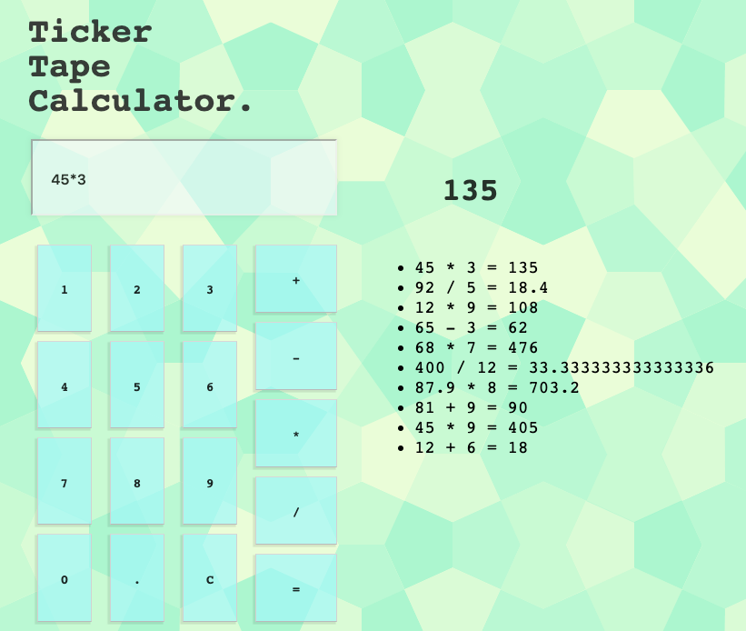

# Ticker Tape Calculator

## Description

This is a digital counterpart to the classic paper roll calculator. This application does basic calculations and keeps a neat and tidy history for the user. It is intuitive and simple to use for both individuals and businesses alike. 

## Technologies Used

- Javascript
- jQuery
- Node
- Express
- HTML
- CSS

## Project Image

## Installation

- Clone or download the repository from GitHub.
- https://github.com/brgeen/jquery-server-side-calculator
- Download and install Node.
- https://nodejs.org/en/download/current/
- Open your terminal and install Node Package Manager.
- `npm install`
- In your terminal, install express.
- `npm install express`
- Start express from your terminal.
- `npm start`
- Open your browser and navigate to http://localhost:5000/

## Contact

Brooks Geenen
brgeen@gmail.com

